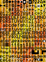
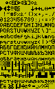
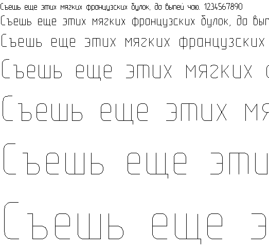
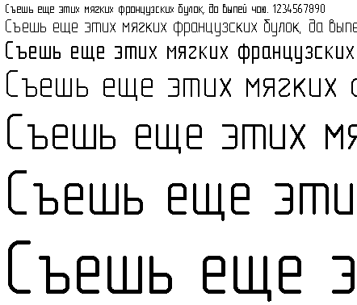
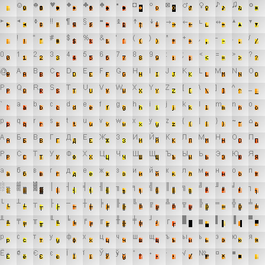
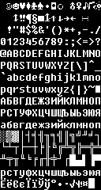
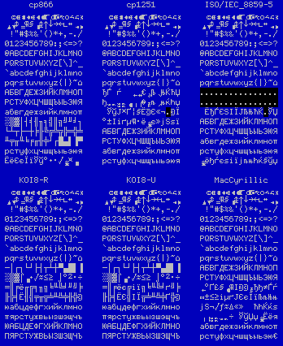

# Где я? Что я? Кто здесь?

Переодически возникает необходимость вывести какие-то буковки на экран. Иногда это экран компудастера, иногда это экран микроконтроллера. Все больше и больше популярности в нашей стране приобретает набор для образовательных целей Ардуино, который уже достаточно широко распространен в школах, детских больницах, хосписах и гаражных кооперативах. К сожалению, наша молодеж и автолюбители сталкиваются с проблемой вывода кириллицы на свои экраны, так как наборчик Ардуино хоть и снабжен многочисленными примерами работы с текстом, но не учитывает потребности малых народов и узких языковых групп. Поэтому мы взяли на себя тяжелый труд по ликвидации колоссального языкового разрыва и восстановлению языковой справедливости.

# Краткий ликбез

В основном шрифты бывают трех типов:
* Пиксельные. Так как обычно экранчики пиксельные, то логично и шрифты хранить в этом же формате и просто быстро-быстро копировать эти самые пиксели. Обычно именно этот тип используется в микроконтроллерах, в библиотеках Arduino и древних компьютерах, вроде ZX-Spectrum. Недостатком этих шрифтов является то, что нельзя произвольно менять размер отрисовки: на экране или появятся артефакты масштабирования, или нужно будет добавлять все символы под новый размер.
* Векторные штрихи. Если требуется рисовать большие буквы, а то и вообще в произвольном масштабе, то лучше использовать шрифты на основе векторных штрихов. Каждая линия такого шрифта - это штрих минимальной толщины. Подобные шрифты отлично подходят, если надо научить лазерный ЧПУ-станок делать надписи. На сегодняшний день практически не встречаются. Примером может выступать шрифт [GOST type A (plotter)](https://isopromat.ru/wp-content/uploads/fonts-GOST.zip)
* Векторные контуры. Самый распространенный тип шрифтов на сегодняшний день. В этих шрифтах каждая линия задана парой контуров, внутренности которых закрашиваются. И хотя этот формат сегодня является доминирующим на компьютерах, в микроконтроллерах почти не используется из-за сложности реализации и фактической ненужности.

Есть и другие типы шрифтов, например, шрифты для emoji или цветные шрифты. Где-то используются PNG-картинки, почти как в древних пиксельных шрифтах, только теперь в цвете, где-то используются сложные системы растеризации и внутренние виртуальные машины, что позволяет задавать оттенки букв. Но в эту степь мы сегодня не пойдем.

Пример шрифта из штрихов:



Пример шрифта из контуров:



С этого момента будем считать, что нам надо где-то взять ПИКСЕЛЬНЫЕ ШРИФТЫ, желательно с кириллицей.

# Где взять шрифты?

* Нарисовать самим
* Стырить из винды
* Стырить из Linux
* Стырить из древних компьютеров вроде C64 / ZX-Spectrum / демок под msdos
* Растеризовать из ttf

# Растеризовать из ttf

Так как шрифтов ttf в мире крайне много, то первым делом в голову приходит сделать растеризацию векторных шрифтов. Увы, но в общем и целом задача не имеет решения.

Если попробовать написать программу "в лоб", которая рисует отдельные глифы на экране, то мы получим огромное количество артефактов:

Шрифт [Fifaks 1.0 dev1](https://myfonts.ru/font/fifaks-10-dev1) явно сделан пиксельным, но сетка символов иногда не вмещает символы целиком:



Шрифт [Fixedsys Excelsior font with programming ligatures](https://github.com/kika/fixedsys) по большей части пиксельный, но некоторые символы выглядят размазанными, другие тоже не влезают в свои знакоместа:



Поэтому если очень хочется, то можно взять такую заготовку, взять древний `mspaint.exe` и ручками доработать шрифт там, где он выглядит совсем отвратительным. Или трансплантировать отдельные глифы из других шрифтов, где они выглядят лучше. Например, я ручками доработал шрифт `Fifaks 1.0 dev1` и получил такую картинку:


Для растеризации можно использовать прилагающийся скрипт `ttf2png.pl` или `rasterizer.pl`, оба скрипта крайне кривые и сделаны из говна и палок, но они могут служить отправной точкой (нет). Как ими пользоваться, читатель может догадаться сам.

К сожалению, подобные гибриды и прочие эксперименты нельзя распространять как готовый продукт, чтобы случайно не нарушить какую-нибудь лицензию.

# Вытащить шрифты из файлов FON

Шрифты в формате FON обычно являются пиксельными и достаточно высокого качества. Если у вас есть лицензионное право или законы вашей страны разрешают использование таких ресурсов, то распаковываем файлы `*.fnt`:

```
mkdir fnt                             # создать директорию fnt
wrestool -x -R -t 8 -o fnt *fon       # распаковать ресурсы из файлов *.fon в текущей директории
perl perl fnt_renamer.pl              # переименовать файлы шрифтов во что-то вменяемое
perl fnt2png.pl 8514oem-oem-10x12.fnt # сконвертить один из шрифтов в картинку
```

# Стырить из Linux

Одним из лучших открытых пиксельных шрифтов является [GNU Unifont](https://en.wikipedia.org/wiki/GNU_Unifont), который среди прочего распространяется в формате `BDF`. Увы, но мне лень писать конвертер этого формата. Он достаточно простой и читателю предлагается это упражнение для самостоятельного исполнения.

# Стырить из древних компьютеров вроде C64 / ZX-Spectrum / демок под msdos


Под старыми системами были замечательные шрифты, которые рисовались годами, даже после официальной смерти этих платформ на рынке. Множество красивых шрифтов можно найти здесь:
* https://damieng.com/typography/zx-origins/ - куча шрифтов в самых разных форматах
* https://github.com/patrickmollohan/c64-fonts - штатные шрифты C64
* https://c64gfx.com/compo/2128 - конкурс шрифтов для C64

Самые лучшие шрифты конечно же лежат в демосцене, а как их оттуда выковыривать - зависит от самой демки. Увы, кириллица в таких шрифтах бывает не слишком часто. Если же она там есть, то это наверняка будет отличный шрифт.

> Шрифт вытащенный из cracktro Vendetta:
>
> 
>
> Увы, не смотря на всю красоту шрифта, в нем нету кириллицы

Как такое вытащить? Берем [GBS](https://github.com/old-games/GBS) и долго крутим ползунки, пока не найдем что-то похожее на шрифты, записываем адреса. Потом как-то так:

```
# dd if=binary.exe bs=239487 skip=1 of=font.bin     # отрезаем от бинарника нужный кусочек
# mkdir aaa                                         # создаем временную директорию
# ffmpeg -f rawvideo -s 8x16 -pix_fmt monob -i font.bin aaa/tst%4d.png # нарезаем буковки
# montage -geometry 8x16+0+0 -tile 16x16 aaa/* font.png                # склеиваем буковки
```

# Немного слов о кодировках

Для компьютера все буквы, которые он выводит на экран - на самом деле байты. К примеру, если в программе вывести байт со значением `48`, то скорее всего
компьютер отобразит символ `0` (ноль), а если значение будет `65`, то будет выведена латинская `A`. Как компьютер узнает, какому коду какой символ соответствует?
Для первых 128 значений есть хороший стандарт: [ASCII](https://ru.wikipedia.org/wiki/ASCII), который потом был дополнен и во времена msdos был известен как [cp437](https://en.wikipedia.org/wiki/Code_page_437).

А что с кириллицей? Как вывести букву `Я`? Сегодня, когда мы почти повсеместно перешли на стандарт `Unicode`, нам нужно просто отобразить символ с номером
1071 (он же 0x42F в 16-ричной системе). И тут нас встречает первая проблема: как нам засунуть такое большое число в 1 байт? Возможно ли это?
Чтобы сделать это возможным, можно воспользоваться одной из современных кодировок, таких как `UTF-8`. Увы, но в этой кодировке все кириллические
символы занимают по 2 байта, что заставляет нас тратить байты с избытком, по сравнению, esli bi mi pisali tekst translitom. Латинские же символы в этой кодировке
занимают по 1 байту, что делает сложным подсчет длинный строки. В принципе, есть и другие кодировки, к примеру `UTF-16`, где для большинства символов
нужно по 2 байта, что решает проблему с измерением длинны строки, но не решает проблему с удвоением объема текста. Еще появляется вопрос: а какие символы
нам вообще нужны в шрифте? Только базовая кириллица? Расширенная кириллица с поддержкой других языков?
Стандарт `Unicode` версииode version 15.1, содержит 149878 символов, покрывая 161 язык мира. Мы точно хотим засунуть все это в наш маленький микроконтроллер?

Но можно воспользоваться старыми и проверенными кодовыми таблицами, или таблицами символов.

Для кириллицы было изобретено множество таких таблиц, но вот основные, которые я смог вспомнить:

```
      cp866               cp1251          ISO/IEC_8859-5
  ☺☻♥♦♣♠•◘○◙♂♀♪♫☼     ☺☻♥♦♣♠•◘○◙♂♀♪♫☼     ☺☻♥♦♣♠•◘○◙♂♀♪♫☼
 ►◄↕‼¶§▬↨↑↓→←∟↔▲▼    ►◄↕‼¶§▬↨↑↓→←∟↔▲▼    ►◄↕‼¶§▬↨↑↓→←∟↔▲▼
  !"#$%&'()*+,-./     !"#$%&'()*+,-./     !"#$%&'()*+,-./
 0123456789:;<=>?    0123456789:;<=>?    0123456789:;<=>?
 @ABCDEFGHIJKLMNO    @ABCDEFGHIJKLMNO    @ABCDEFGHIJKLMNO
 PQRSTUVWXYZ[\]^_    PQRSTUVWXYZ[\]^_    PQRSTUVWXYZ[\]^_
 `abcdefghijklmno    `abcdefghijklmno    `abcdefghijklmno
 pqrstuvwxyz{|}~⌂    pqrstuvwxyz{|}~⌂    pqrstuvwxyz{|}~⌂
 АБВГДЕЖЗИЙКЛМНОП    ЂЃ‚ѓ„…†‡€‰Љ‹ЊЌЋЏ    €‚ƒ„…†‡ˆ‰Š‹ŒŽ
 РСТУФХЦЧШЩЪЫЬЭЮЯ    ђ‘’“”•–—�™љ›њќћџ    ‘’“”•–—˜™š›œžŸ
 абвгдежзийклмноп     ЎўЈ¤Ґ¦§Ё©Є«¬­®Ї     ЁЂЃЄЅІЇЈЉЊЋЌ­ЎЏ
 ░▒▓│┤╡╢╖╕╣║╗╝╜╛┐    °±Ііґµ¶·ё№є»јЅѕї    АБВГДЕЖЗИЙКЛМНОП
 └┴┬├─┼╞╟╚╔╩╦╠═╬╧    АБВГДЕЖЗИЙКЛМНОП    РСТУФХЦЧШЩЪЫЬЭЮЯ
 ╨╤╥╙╘╒╓╫╪┘┌█▄▌▐▀    РСТУФХЦЧШЩЪЫЬЭЮЯ    абвгдежзийклмноп
 рстуфхцчшщъыьэюя    абвгдежзийклмноп    рстуфхцчшщъыьэюя
 ЁёЄєЇїЎў°∙·√№¤■     рстуфхцчшщъыьэюя    №ёђѓєѕіїјљњћќ§ўџ

    KOI8-R                KOI8-U            MacCyrillic
  ☺☻♥♦♣♠•◘○◙♂♀♪♫☼     ☺☻♥♦♣♠•◘○◙♂♀♪♫☼     ☺☻♥♦♣♠•◘○◙♂♀♪♫☼
 ►◄↕‼¶§▬↨↑↓→←∟↔▲▼    ►◄↕‼¶§▬↨↑↓→←∟↔▲▼    ►◄↕‼¶§▬↨↑↓→←∟↔▲▼
  !"#$%&'()*+,-./     !"#$%&'()*+,-./     !"#$%&'()*+,-./
 0123456789:;<=>?    0123456789:;<=>?    0123456789:;<=>?
 @ABCDEFGHIJKLMNO    @ABCDEFGHIJKLMNO    @ABCDEFGHIJKLMNO
 PQRSTUVWXYZ[\]^_    PQRSTUVWXYZ[\]^_    PQRSTUVWXYZ[\]^_
 `abcdefghijklmno    `abcdefghijklmno    `abcdefghijklmno
 pqrstuvwxyz{|}~⌂    pqrstuvwxyz{|}~⌂    pqrstuvwxyz{|}~⌂
 ─│┌┐└┘├┤┬┴┼▀▄█▌▐    ─│┌┐└┘├┤┬┴┼▀▄█▌▐    АБВГДЕЖЗИЙКЛМНОП
 ░▒▓⌠■∙√≈≤≥ ⌡°²·÷    ░▒▓⌠■∙√≈≤≥ ⌡°²·÷    РСТУФХЦЧШЩЪЫЬЭЮЯ
 ═║╒ё╓╔╕╖╗╘╙╚╛╜╝╞    ═║╒ёє╔ії╗╘╙╚╛ґ╝╞    †°Ґ£§•¶І®©™Ђђ≠Ѓѓ
 ╟╠╡Ё╢╣╤╥╦╧╨╩╪╫╬©    ╟╠╡ЁЄ╣ІЇ╦╧╨╩╪Ґ╬©    ∞±≤≥іµґЈЄєЇїЉљЊњ
 юабцдефгхийклмно    юабцдефгхийклмно    јЅ¬√ƒ≈∆«»… ЋћЌќѕ
 пярстужвьызшэщчъ    пярстужвьызшэщчъ    –—“”‘’÷„ЎўЏџ№Ёёя
 ЮАБЦДЕФГХИЙКЛМНО    ЮАБЦДЕФГХИЙКЛМНО    абвгдежзийклмноп
 ПЯРСТУЖВЬЫЗШЭЩЧЪ    ПЯРСТУЖВЬЫЗШЭЩЧЪ    рстуфхцчшщъыьэю€

```

Шрифт Fifaks может отобразить это так:



Если мы используем кодировку `cp866`, то для вывода буквы `Я` нужно вывести символ с номером 159 (или 0x9F), что отлично умещается в 1 байт и решает
множество проблем нашего крохотного микроконтроллера. В довесок у нас есть символы псевдографики, которыми мы можем рисовать рамочки и даже есть несколько
смайликов и иконок, которые тоже можно использовать. К недостаткам этой кодировки можно пожалуй отнести только отсутствие «ёлочек», которые есть
в кодировке `cp1251` (кодировке кириллицы в Windows), но если «ёлочки» или какой-то другой символ сильно нужны, никто не мешает выбрать другую кодировку.
Лично я для себя сделал выбор в пользу `cp866`.

Всем любопытным крайне рекомендую: http://aspell.net/charsets/cyrillic.html - краткая история кодировок с кириллицей

# Мы стырили шрифт... Картинку...? А что с ней дальше делать?

Так как у нас цель сконвертить шрифт под микроконтроллер, то такие фичи как кернинг нам не сильно нужны, равно как и полутона. Следовательно, чтобы уменьшить размер нашего битмапа, мы смело можем конвертить его в 1-битную картинку. К примеру, сконвертим шрифт от редактора BGE:


