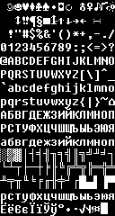
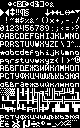

# Где я? Что я? Кто здесь?

Переодически возникает необходимость вывести какие-то буковки на экран. Иногда это экран компудастера, иногда это экран микроконтроллера. Все больше и больше популярности в нашей стране приобретает набор для образовательных целей Ардуино, который уже достаточно широко распространен в школах, детских больницах, хосписах и гаражных кооперативах. К сожалению, наша молодеж и автолюбители сталкиваются с проблемой вывода кириллицы на свои экраны, так как наборчик Ардуино хоть и снабжен многочисленными примерами работы с текстом, но не учитывает потребности малых народов и узких языковых групп. Поэтому мы взяли на себя тяжелый труд по ликвидации колоссального языкового разрыва и восстановлению языковой справедливости.

# Краткий ликбез

В основном шрифты бывают трех типов:
* Пиксельные. Так как обычно экранчики пиксельные, то логично и шрифты хранить в этом же формате и просто быстро-быстро копировать эти самые пиксели. Обычно именно этот тип используется в микроконтроллерах, в библиотеках Arduino и древних компьютерах, вроде ZX-Spectrum. Недостатком этих шрифтов является то, что нельзя произвольно менять размер отрисовки: на экране или появятся артефакты масштабирования, или нужно будет добавлять все символы под новый размер.
* Векторные штрихи. Если требуется рисовать большие буквы, а то и вообще в произвольном масштабе, то лучше использовать шрифты на основе векторных штрихов. Каждая линия такого шрифта - это штрих минимальной толщины. Подобные шрифты отлично подходят, если надо научить лазерный ЧПУ-станок делать надписи. На сегодняшний день практически не встречаются. Примером может выступать шрифт [GOST type A (plotter)](https://isopromat.ru/wp-content/uploads/fonts-GOST.zip)
* Векторные контуры. Самый распространенный тип шрифтов на сегодняшний день. В этих шрифтах каждая линия задана парой контуров, внутренности которых закрашиваются. И хотя этот формат сегодня является доминирующим на компьютерах, в микроконтроллерах почти не используется из-за сложности реализации и фактической ненужности.

Есть и другие типы шрифтов, например, шрифты для emoji или цветные шрифты. Где-то используются PNG-картинки, почти как в древних пиксельных шрифтах, только теперь в цвете, где-то используются сложные системы растеризации и внутренние виртуальные машины, что позволяет задавать оттенки букв. Но в эту степь мы сегодня не пойдем.

Пример шрифта из штрихов:


Пример шрифта из контуров:


С этого момента будем считать, что нам надо где-то взять ПИКСЕЛЬНЫЕ ШРИФТЫ, желательно с кириллицей.

# Где взять шрифты?

* Нарисовать самим
* Стырить из винды
* Стырить из Linux
* Стырить из древних компьютеров вроде C64 / ZX-Spectrum / демок под msdos
* Растеризовать из ttf

# Растеризовать из ttf

Так как шрифтов ttf в мире крайне много, то первым делом в голову приходит сделать растеризацию векторных шрифтов. Увы, но в общем и целом задача не имеет решения.

Если попробовать написать программу "в лоб", которая рисует отдельные глифы на экране, то мы получим огромное количество артефактов:


Шрифт [Fifaks 1.0 dev1](https://myfonts.ru/font/fifaks-10-dev1) явно сделан пиксельным, но сетка символов иногда не вмещает символы целиком.


Шрифт [Fixedsys Excelsior font with programming ligatures](https://github.com/kika/fixedsys) по большей части пиксельный, но некоторые символы выглядят размазанными.

Поэтому если очень хочется, то можно взять такую заготовку, взять древний `mspaint.exe` и ручками доработать шрифт там, где он выглядит совсем отвратительным. Или трансплантировать отдельные глифы из других шрифтов, где они выглядят лучше. Например, я ручками доработал шрифт `Fifaks 1.0 dev1` и получил такую картинку:


Мои личные наработки и изменения к шрифту `Fifaks 1.0 dev1`

Для растеризации можно использовать прилагающийся скрипт `ttf2tiled.pl`, который крайне кривой и сделан из говна и палок, но может служить отправной точкой (нет).

К сожалению, подобные гибриды и прочие эксперименты нельзя распространять как готовый продукт, чтобы случайно не нарушить какую-нибудь лицензию.

# Вытащить шрифты из файлов FON

Шрифты в формате FON обычно являются пиксельными и достаточно высокого качества. Если у вас есть лицензионное право или законы вашей страны разрешают использование таких ресурсов, то распаковываем файлы `*.fnt`:

```
mkdir fnt                             # создать директорию fnt
wrestool -x -R -t 8 -o fnt *fon       # распаковать ресурсы из файлов *.fon
perl perl fnt_renamer.pl              # переименовать файлы шрифтов во что-то вменяемое
perl fnt2png.pl 8514oem-oem-10x12.fnt # сконвертить один из шрифтов в картинку
```

# Стырить из Linux

Одним из лучших открытых пиксельных шрифтов является [GNU Unifont](https://en.wikipedia.org/wiki/GNU_Unifont), который среди прочего распространяется в формате `BDF`. Увы, но мне лень писать конвертер этого формата. Он достаточно простой и читателю предлагается это упражнение для самостоятельного исполнения.

# Стырить из древних компьютеров вроде C64 / ZX-Spectrum / демок под msdos


Под старыми системами были замечательные шрифты, которые рисовались годами, даже после официальной смерти этих платформ на рынке. Множество красивых шрифтов можно найти здесь:
* https://damieng.com/typography/zx-origins/ - куча шрифтов в самых разных форматах
* https://github.com/patrickmollohan/c64-fonts - штатные шрифты C64
* https://c64gfx.com/compo/2128 - конкурс шрифтов для C64

Самые лучшие шрифты конечно же лежат в демосцене, а как их оттуда выковыривать - зависит от самой демки. Увы, кириллица в таких шрифтах бывает не слишком часто. Если же она там есть, то это наверняка будет отличный шрифт.


Шрифт вытащенный из cracktro Vendetta

Как такое вытащить? Берем [GBS](https://github.com/old-games/GBS) и долго крутим ползунки, пока не найдем что-то нам нужное. Потом как-то так:

```
# dd if=binary.exe bs=239487 skip=1 of=font.bin     # отрезаем от бинарника нужный кусочек
# mkdir aaa                                         # создаем временную директорию
# ffmpeg -f rawvideo -s 8x16 -pix_fmt monob -i font.bin aaa/tst%4d.png # нарезаем буковки
# montage -geometry 8x16+0+0 -tile 16x16 aaa/* font2.png               # склеиваем буковки
```

# Мы стырили шрифт, а что с ним дальше делать?

Так как у нас цель сконвертить шрифт под микроконтроллер, то такие фичи как кернинг нам не сильно нужны, равно как и полутона. Следовательно, чтобы уменьшить размер нашего битмапа, мы смело можем конвертить его в 1-битную картинку. К примеру, сконвертим шрифт от редактора BGE:


